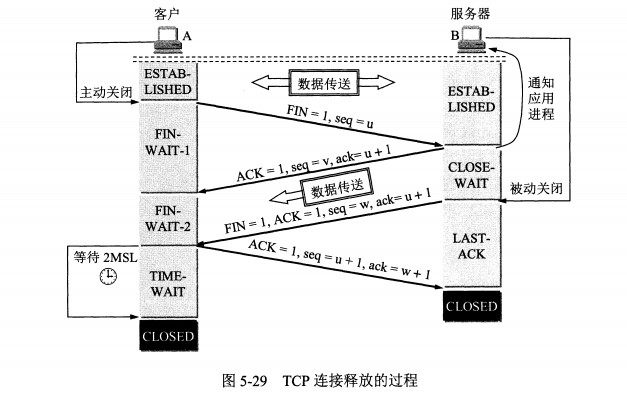

# 概述

## 计算机网络体系结构


### TCP/IP 体系结构

现在的 TCP/IP 体系结构不严格遵循 OSI 分层概念，应用层可能会直接使用 IP 层或者网络接口层。


# 网络层

## IP 数据报格式


- **版本** : 有 4（IPv4）和 6（IPv6）两个值；
- **首部长度** : 占 4 位，因此最大值为 15。值为 1 表示的是 1 个 32 位字的长度，也就是 4 字节。因为首部固定长度为 20 字节，因此该值最小为 5。如果可选部分的长度不是 4 字节的整数倍，就用尾部的填充部分来填充。
- **区分服务v : 用来获得更好的服务，一般情况下不使用。
- **总长度** : 包括首部长度和数据部分长度。
- **标识** : 在数据报长度过长从而发生分片的情况下，相同数据报的不同分片具有相同的标识符。
- **片偏移** : 和标识符一起，用于发生分片的情况。片偏移的单位为 8 字节。
- **生存时间** ：TTL，它的存在是为了防止无法交付的数据报在互联网中不断兜圈子。以路由器跳数为单位，当 TTL 为 0 时就丢弃数据报。
- **协议** ：指出携带的数据应该上交给哪个协议进行处理，例如 ICMP、TCP、UDP 等。
- **首部检验和** ：因为数据报每经过一个路由器，都要重新计算检验和，因此检验和不包含数据部分可以减少计算的工作量。

## IP 地址编址

IP 地址 ::= {< 网络号 >, [< 子网号 >,] < 主机号 >}


## IP 地址和 MAC 地址

网络层实现主机之间的通信，而链路层实现具体每段链路之间的通信。因此在通信过程中，IP 数据报的源地址和目的地址始终不变，而 MAC 地址随着链路的改变而改变。

### 地址解析协议 ARP

实现由 IP 地址得到 MAC 地址。

## 路由选择协议
可以把路由选择协议划分为两大类:
- 内部网关协议 IGP（Interior Gateway Protocol）：在 AS 内部使用，如 RIP 和 OSPF。
- 外部网关协议 EGP（External Gateway Protocol）：在 AS 之间使用，如 BGP。

# 运输层

## UDP 和 TCP

**对比TCP & UDP**
- TCP面向连接（三次握手），通信前需要先建立连接；UDP面向无连接，通信前不需要连接。
- TCP通过序号、重传、流量控制、拥塞控制实现可靠传输；UDP不保障可靠传输，尽最大努力交付。
- TCP面向字节流传输，因此可以被分割并在接收端重组；UDP面向数据报传输。

### UDP（User Datagram Protocol）


### TCP（Transmission Control Protocol）


- 序号（32bit）：传输方向上字节流的字节编号。初始时序号会被设置一个随机的初始值（ISN），之后每次发送数据时，序号值 = ISN + 数据在整个字节流中的偏移。假设A -> B且ISN = 1024，第一段数据512字节已经到B，则第二段数据发送时序号为1024 + 512。用于解决网络包乱序问题。
- 确认号（32bit）：接收方对发送方TCP报文段的响应，其值是收到的序号值 + 1。
- 首部长（4bit）：标识首部有多少个4字节 * 首部长，最大为15，即60字节。
- 标志位（6bit）：
    - URG：标志紧急指针是否有效。    
    - ACK：标志确认号是否有效（确认报文段）。用于解决丢包问题。    
    - PSH：提示接收端立即从缓冲读走数据。    
    - RST：表示要求对方重新建立连接（复位报文段）。    
    - SYN：表示请求建立一个连接（连接报文段）。
    - FIN：表示关闭连接（断开报文段）。
- 窗口（16bit）：接收窗口。用于告知对方（发送方）本方的缓冲还能接收多少字节数据。用于解决流控。
- 校验和（16bit）：接收端用CRC检验整个报文段有无损坏。

#### TCP三次握手


#### TCP四次挥手



## QAs

### 为什么握手是三次，挥手是四次？
- 对于握手：握手只需要确认双方通信时的初始化序号，保证通信不会乱序。（第三次握手必要性：假设服务端的确认丢失，连接并未断开，客户机超时重发连接请求，这样服务器会对同一个客户机保持多个连接，造成资源浪费。）
- 对于挥手：TCP是双工的，所以发送方和接收方都需要FIN和ACK。之所以不是三次而是四次，主要是因为被动关闭方将"对主动关闭报文的确认"和"关闭连接"两个操作分两次进行。"对主动关闭报文的确认"是为了快速告知主动关闭方，此关闭连接报文已经收到。此时被动方不立即关闭连接是为了将缓冲中剩下的数据从输出流发回主动关闭方（主动方接收到数据后同样要进行确认），因此要把"确认关闭"和"关闭连接"分两次进行。

"对主动关闭报文的确认"是为了快速告知主动关闭方，此关闭连接报文已经收到。此时被动方不立即关闭连接是为了将缓冲中剩下的数据从输出流发回主动关闭方（主动方接收到数据后同样要进行确认），因此要把"确认关闭"和"关闭连接"分两次进行。

### 流量控制原理？
- 目的是接收方通过TCP头窗口字段告知发送方本方可接收的最大数据量，用以解决发送速率过快导致接收方不能接收的问题。所以流量控制是点对点控制。
- TCP是双工协议，双方可以同时通信，所以发送方接收方各自维护一个发送窗和接收窗。
    - 发送窗：用来限制发送方可以发送的数据大小，其中发送窗口的大小由接收端返回的TCP报文段中窗口字段来控制，接收方通过此字段告知发送方自己的缓冲（受系统、硬件等限制）大小。
    - 接收窗：用来标记可以接收的数据大小。
- TCP是流数据，发送出去的数据流可以被分为以下四部分：已发送且被确认部分 | 已发送未被确认部分 | 未发送但可发送部分 | 不可发送部分，其中发送窗 = 已发送未确认部分 + 未发但可发送部分。接收到的数据流可分为：已接收 | 未接收但准备接收 | 未接收不准备接收。接收窗 = 未接收但准备接收部分。
- 发送窗内数据只有当接收到接收端某段发送数据的ACK响应时才移动发送窗，左边缘紧贴刚被确认的数据。接收窗也只有接收到数据且最左侧连续时才移动接收窗口。

### 拥塞控制原理？
- 拥塞控制目的是防止数据被过多注网络中导致网络资源（路由器、交换机等）过载。因为拥塞控制涉及网络链路全局，所以属于全局控制。控制拥塞使用拥塞窗口。
- TCP拥塞控制算法：
    - 慢开始 & 拥塞避免：先试探网络拥塞程度再逐渐增大拥塞窗口。每次收到确认后拥塞窗口翻倍，直到达到阀值ssthresh，这部分是慢开始过程。达到阀值后每次以一个MSS为单位增长拥塞窗口大小，当发生拥塞（超时未收到确认），将阀值减为原先一半，继续执行线性增加，这个过程为拥塞避免。
    - 快速重传 & 快速恢复：略。
    - 最终拥塞窗口会收敛于稳定值。

### 如何区分流量控制和拥塞控制？
- 流量控制属于通信双方协商；拥塞控制涉及通信链路全局。
- 流量控制需要通信双方各维护一个发送窗、一个接收窗，对任意一方，接收窗大小由自身决定，发送窗大小由接收方响应的TCP报文段中窗口值确定；拥塞控制的拥塞窗口大小变化由试探性发送一定数据量数据探查网络状况后而自适应调整。
- 实际最终发送窗口 = min{流控发送窗口，拥塞窗口}。

### TCP如何提供可靠数据传输的？
- 建立连接（标志位）：通信前确认通信实体存在。
- 序号机制（序号、确认号）：确保了数据是按序、完整到达。
- 数据校验（校验和）：CRC校验全部数据。
- 超时重传（定时器）：保证因链路故障未能到达数据能够被多次重发。
- 窗口机制（窗口）：提供流量控制，避免过量发送。
- 拥塞控制：同上。

### TCP soctet交互流程？
- 服务器：
  - TCP：socket -> bind -> **listen -> accept ->** recv/send -> close
  - UDP：socket -> bind -> recvfrom/sendto -> close
```
- 创建socket -> int socket(int domain, int type, int protocol);
- 绑定socket和端口号 -> int bind(int sockfd, const struct sockaddr *addr, socklen_t addrlen);
- 监听端口号 -> int listen(int sockfd, int backlog);
- 接收用户请求 -> int accept(int sockfd, struct sockaddr *addr, socklen_t *addrlen);
- 从socket中读取字符 -> ssize_t read(int fd, void *buf, size_t count);
- 关闭socket -> int close(int fd);
```

- 客户机：
  - TCP：socket -> **connect ->** send/recv -> close
  - UDP：socket -> sendto/recvfrom -> close
```
- 创建socket -> int socket(int domain, int type, int protocol);
- 连接指定计算机 -> int connect(int sockfd, struct sockaddr* addr, socklen_t addrlen);
- 向socket写入信息 -> ssize_t write(int fd, const void *buf, size_t count);
- 关闭oscket -> int close(int fd);
```

# 词表
```
ISO/OSI(Intenational Standard Organization/Open System Interconnect)
TCP/IP (Transmission Control Protocol)/(Internet Protocol)
UDP(User Datagram Protocol)

链路层
LLC (Logical Link Control)
MAC (media access control) {
信道划分：FDM(Frequency division multiple access)/CDM(Code Division)/TDM/WDM
随机访问（争用）：{
CSMA/CD(Carrier sense multiple access with collision detection)：先听再发，边发边听，冲突停发，随机重发（二进制指数退避）
CSMA/CA(collision avoidance)：2t争用期}
}
PPP(Point-to-Point Protocol)
HDLC(High-level Data Link Control)
ARQ (Automatic Repeat reQuest)

网络层
IGP：
RIP(Routing Information Protocol 路由信息协议)[应用层,UDP]、
OSPF(Open Shortest Path First 开放最短路径优先)[网络层,IP]
BGP[应用层,TCP]
ARP(address resolution protocol)[网络层]
     ARP攻击就是通过伪造IP地址和MAC地址实现ARP欺骗，能够在网络中产生大量的ARP通信量使网络阻塞，攻击者只要持续不断的发出伪造的ARP响应包就能更改目标主机ARP缓存中的IP-MAC条目，造成网络中断或中间人攻击。
DHCP(Dynamic Host Configuration Protocol)[应用层,UDP]
ICMP(Internet Control Message Protocol)[IP层]
NAT,Network Address Translation

应用层
DNS(Domain Name Servers)
FTP
SMTP
POP3(Post Office Protocol)
IMAP(Internet Message Access Protocol)
HTTP(Hypertext Transfer Protocol)

基带信号就是将数字信号 1 或 0 直接用两种不同的电压来表示，然后送到线路上去传输。
宽带信号则是将基带信号进行调制后形成的频分复用模拟信号。

MIME(Multipurpose Internet Mail Extensions)，传输非ASCII字符文本
```
