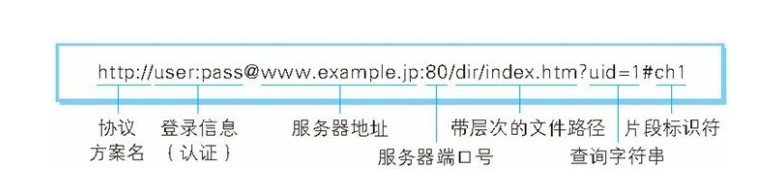
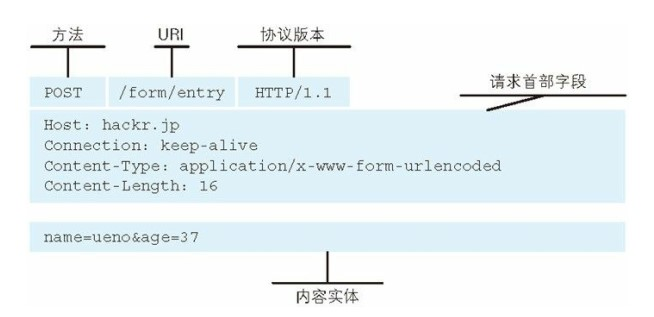
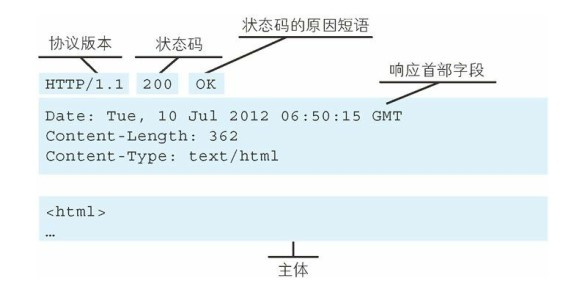

## 基础概念

HTTP协议工作在应用层，端口号是80，在传输层由TCP协议为其提供服务。

**HTTP工作流程**
- 建立起客户机和服务器连接。
- 建立连接后，客户机发送一个请求给服务器。
- 服务器收到请求给予响应信息。
- 客户端浏览器将返回的内容解析并呈现，断开连接。

## URL

## 请求报文 响应报文

## HTTP 状态码

| 状态码 | 类别 | 原因短语 |
| --- | --- | --- |
| 1XX | Informational（信息性状态码） | 接收的请求正在处理 |
| 2XX | Success（成功状态码） | 请求正常处理完毕 |
| 3XX | Redirection（重定向状态码） | 需要进行附加操作以完成请求 |
| 4XX | Client Error（客户端错误状态码） | 服务器无法处理请求 |
| 5XX | Server Error（服务器错误状态码） | 服务器处理请求出错 |

## HTTPs
HTTP 有以下安全性问题：
- 使用明文进行通信，内容可能会被窃听；
- 不验证通信方的身份，通信方的身份有可能遭遇伪装；
- 无法证明报文的完整性，报文有可能遭篡改。

HTTPS协议的本质就是HTTP + SSL（Secure Socket Layer）。在HTTP报文进入TCP报文之前，先使用SSL对HTTP报文进行加密。从网络的层级结构看它位于HTTP协议与TCP协议之间。HTTPs 提供了加密、认证和完整性保护。

## QAs

### 从输入 URL 到页面加载发生了什么？

1. DNS解析（DNS缓存->hosts || 路由器缓存->ISP解析->递归查询）
2. TCP连接（SYN -> SYN+ACK -> ACK）
3. 发送HTTP请求（HTTPs=HTTP->SSL->TCP）
4. 服务器处理请求并返回HTTP报文
5. 浏览器解析渲染页面
6. 连接结束
