> ref: ***System and Software Verification***

# Part I. Principles and Techniques


## Automata (自动机)

### Introductory Examples
The systems best suited for verification by model checking techniques are those that are easily modeled by (finite) automata. Briefly put, an automaton is a machine evolving from one state to another under the action of transitions.

An automaton (or part of an automaton) is often depicted by drawing each state as a circle and each transition as an arrow. An incoming arrow without origin identifies the initial state.

>We assume from here onwards that an automaton has a finite number of states and transitions, unless we specifically mention otherwise.

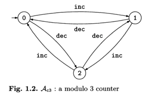

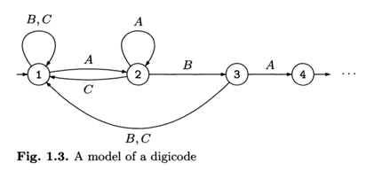

The digicode example will serve to illustrate two fundamental notions, that of an *execution* and that of an *execution tree* of the system model.

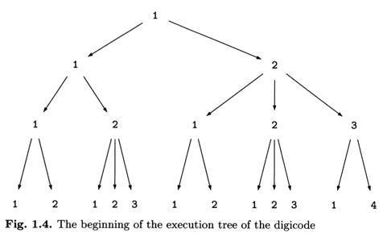

An essential step in the modeling process is the construction of an automa- ton, representing the system under consideration, in which we can associate with each state some elementary properties which we know to be true or false.

In our ongoing example, we might be led to define the elementary properties:
* PA: an A has just been keyed in; 
* PB: a B has just been keyed in; 
* Pc: a C has just been keyed in.

The PA property holds in states 2 and 4, PB holds in state 3 alone (indeed not in state 1, which could also have been accessed by keying in C), and Pc holds in no state.

Let us also define the following properties:
* pred2 : the preceding state in an execution is 2; 
* pred3 : the preceding state in an execution is 3.

Hence pred2 holds in state 3 alone and pred3 holds in state 4 alone. Now consider an execution which results in an open door, that is, an execution ending in state 4. Since pred3 holds in state 4, this execution must end with the sequence 3 4. But pred2 holds in state 3, hence in fact the execution ends with the sequence 2 3 4. Since PA holds in states 2 and 4 and PB holds in state 3, we conclude that the last three letters keyed in were A, B, A in that order.

Model checking precisely consists of techniques making it possible to au- tomatically perform such verifications.

### A Few Definitions

**Automata**

A set `Prop = {P1 , ... }` of elementary propositions (properties) is given. An automaton is a tuple `A = <Q, E, T, q0 , l>` in which
* `Q` is a finite set of states;
* `E` is the finite set of transition labels;
* `T ⊆ Q x E x Q` is the set of transitions;
* `q0` is the initial state of the automaton;
* `l` is the mapping which associates with each state of Q the finite set of elementary properties which hold in that state.

If we restrict our attention to the four visible states on figure 1.3, the modeling of the digicode corresponds to the following formal automaton definition:

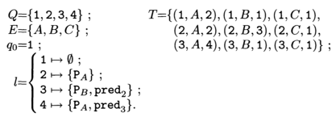

**Graphical representation**

We will henceforth often represent au- tomata with atomic propositions appearing within the states verifying them. Occasionally, for lack of space, we will omit some propositions, or some state names.

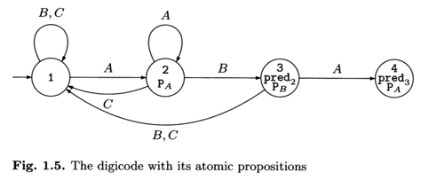

**Formal definition of behavior**

A path of an automaton A is simply a sequence CT, finite or infinite, of transitions (qi,ei,qi') of A which follow each other, that is, such that qi'=qi+1 for each i. 
We often label such a sequence in the form `q1 --e1→ q2 --e2→ q3 --e3→ ...`

**reachable state**

A state is said to be reachable if it appears in the execution tree of the automaton, or in other words, if there exists at least one execution in which it appears.

### A Printer Manager

Consider another example, that of a printer shared by two users.

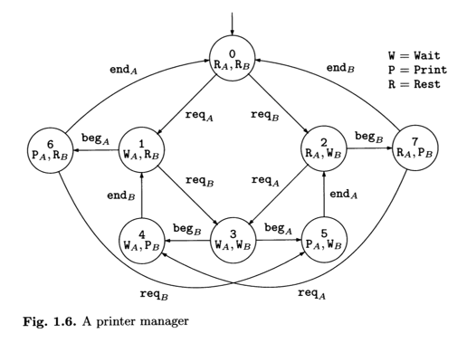

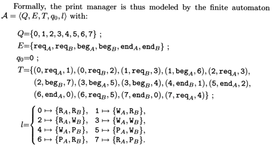

### A Few More Variables

The classical dichotomy between control and data: the "states+transitions" constructs of an automaton represent the control, and the variables represent the data.

An automaton interacts with variables in two ways:
* Assignments: a transition can modify the value of one (or more) variable(s). Hence in the digicode, transitions corresponding to a mistake, that is, all transitions except (1, A, 2), (2, B, 3) et (3, A, 4), would increase the counter.
* Guards: a transition can be guarded by a condition on the variables. This means that the transition cannot occur unless the condition on the vari- ables holds.

Back to the digicode again, if we wished to tolerate no more than three mistakes from the user, the transitions corresponding to a mistake (1, B, 1), (1,C, 1), (2,C, 1), etc. would be guarded by the condition ctr < 3. We then refine the system by adding an alarm which sounds when four mistakes are detected. We create a new state err and three transitions from 1 to err, 2 to err and 3 to err guarded by the condition ctr = 3.

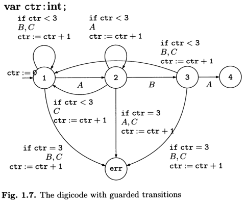

*Graphical representation.* the guards are preceded by the keyword if, then come the transition labels, and in the end come the assignments.

*Unfolding.* It is often necessary, in order to apply model checking methods for instance, to unfold the behavior of an automaton with variables into a state graph in which the possible transitions (and those only) appear and the configurations are clearly marked.

The states of the unfolded automaton are called global states. After unfolding, we obtain the automaton of figure 1.8.

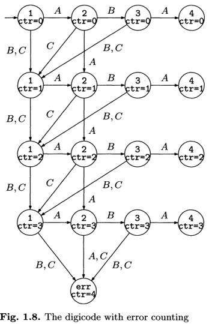

Note that the transitions are no longer guarded. Since we explicitly know the value of the counter in each state. Note also that there are no assignments on the transitions. Since we know the value of the counter in each state.

### Synchronized Product

To build a model of the overall system, it is therefore natural to first model the system components. Then, the global automaton is obtained from the component automata by having them cooperate.

There are many ways of achieving this cooperation - we say *synchronization* - between automata.

Note that an automaton representing the overall system often has so many states that constructing it directly is next to impossible. We speak of state explosion.

For example, to model a system made up of a counter modulo 2, a counter modulo 3 and a counter modulo 4,  three automata having 2, 3 and 4 states respectively. The global system automaton, denoted Accc, then has 2 x 3 x 4 = 24 states. 

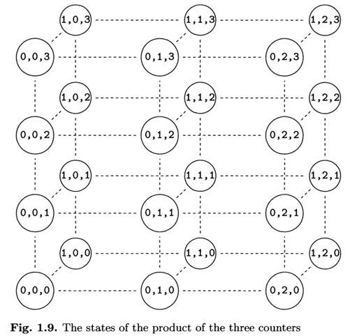

If no synchronization is desired, then each component in each state (that is, each individual counter) can be decremented, incremented, or left unchanged. This yields 3 x 3 x 3 = 27 possible choices.

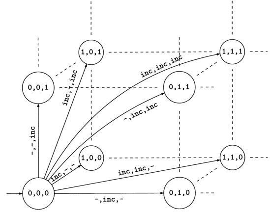

**Synchronized product**

Let us consider a family of n automata, `Vi ∈ {1, ... , n}` `Ai = <Qi, Ei, Ti, q0i, li>`. The *cartesian product* `A1 x · · · x An` of these automata is simply the automaton `A = <Q, E, T, q0 , l>` with:

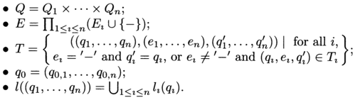

Hence, in a cartesian product, each component A2 may, in a transition, either do nothing (fictitious action `-`) or perform a "local" transition. There is no synchronization requirement whatsoever between the various components.

To synchronize the components, we will restrict the transitions allowed in the cartesian product. We thus define a *synchronization set*:
```
Sync ⊆ ∏_1≤i≤n (Ei U {-})
```
Sync indicates, among the labels of the cartesian product, those which really correspond to a synchronization (they are permitted) and those which do not (they are forbidden and do not appear in the resulting automaton).
> eg: Sync = {(inc,inc,inc),(dec,dec,dec)}

A synchronized product is thus given by the family of components automata and the synchronization set.

That is, an execution of the synchronized product is an execution of the cartesian product in which all transitions are labelled by an element from Sync. The synchronized product can thus be defined by replacing, in the direct product definition, the clause which specifies the set of transitions, by:

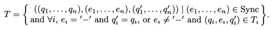


**Relabelling**

Once a complicated automaton is constructed as a synchronization of many smaller automata representing subsystems, it is customary to replace some labels in the product automaton.

**Reachable states**

Deciding if some state in a synchronized product is reachable is far from obvious. Reachability of course heavily depends on the accompanying synchronization constraints.

Figure 1.11 depicts the strongly coupled product of our three counters when only the states reachable from the initial state are considered, together with the transitions linking these states. Each transition is a (triple) increment or a (triple) decrement.

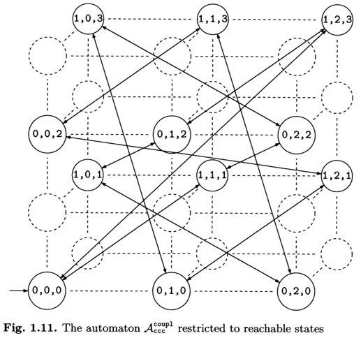

In the sequel, we will call reachability graph the automaton obtained (from a given automaton) by deleting the non-reachable states.

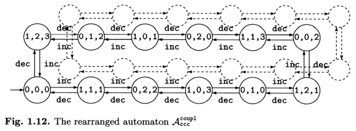

**Reachable states and verification**

When a system has to be verified, it often turns out that the property we are interested in is simply expressible in terms of reachability.

### Synchronization by Message Passing

Among transition labels, we distinguish those associated with emitting a message `m`, denoted `!m` and those associated with the reception of this message, denoted `?m`.

A ***smallish elevator***.

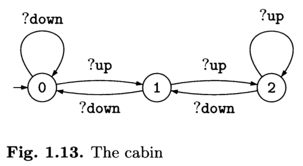

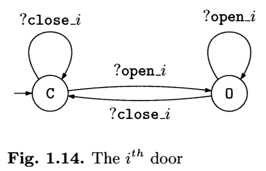

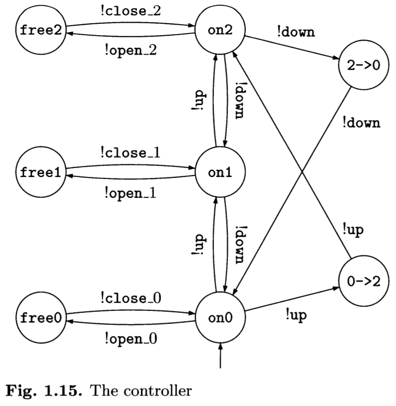

The automaton modeling the elevator is then obtained as the synchro- nized product of these five automata. (door 0, door 1, door 2, the cabin, and the controller)

The synchronization constraints reduce to the simultaneous execution of the message emissions/receptions, formally expressed as:
```
Sync= {
  (?open_1, -, -, -, !open_1), (?close_1, -, -, -, !close_1), 
  (-, ?open_2,-,-, !open_2), (-,?close_2,-,-, !close_2), 
  (-, -, ?open_3, -, !open_3), (-, -, ?close_3, -, !close_3), 
  (-, -,-,?down, !down), (-, -,-,?up, !up) 
}.
```

Before declaring this elevator operational, we would like to check a number of properties, for example that "the door on a given floor cannot open while the cabin is on a different floor" (P1), and that "the cabin cannot move while one of the doors is open" (P2).

A model checker has the ability to build the synchronized product of our five automata and to check automatically whether the above properties hold.

***Asynchronous messages***.

We speak of asynchronous communication when messages are not received instantly. In general, it is assumed that messages emitted but not yet received remain somewhere within one or more communication channels, occasionally called buffers, where they are most often processed in FIFO order (first in, first out): messages are forwarded in the order in which they were emitted.

### Synchronization by Shared Variables

Consider once again the case of the two users A et B who share a printer.

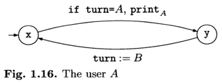

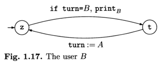

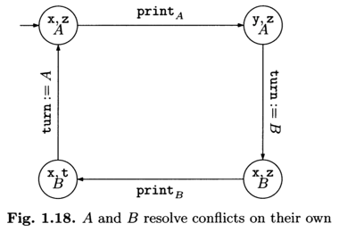

>Obviously, the simplistic protocol implemented by the two users guarantees that no state of the form (y,t,-) is reachable. The users are assured that they will never be printing simultaneously. But their protocol forbids either user from printing twice in a row!

We present a simplified version of an algorithm due to Peterson.
The two users now decide to share 3 variables:
* a variable rA (r for "request") which the user A sets to true when he wishes to print. Initially rA is false;
* similarly, rB plays the corresponding role for user B; 
* and again the turn variable, to settle conflicts.

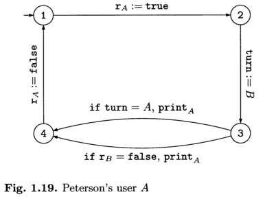

The automaton modeling the algorithm is thus built from these two automata and from the three shared variables rA , rB and turn. A state is then a tuple consisting of, in that order, the state ofthe automaton for A, the state of the automaton for B, the value of rA, the value of rB and that of turn. This automaton thus has 4x4x2x2x2=128 states.Infact,the number of reachable states is only 21. In particular, we can show (or ask a model checker to show) that no state of the form (4, 4, - , - , - ) is reachable, guaranteeing in this way that the two users cannot be printing simultaneously.


## Temporal Logic (时态逻辑)

Let us return to the elevator example.

* any elevator request must ultimately be satisfied;
* the elevator never traverses a floor for which a request is pending without satisfying this request.

These properties concern the dynamic behavior of the system. They could be formalized using notation of the kind "the position at time t".

* H(t): the cabin position at time t
* app(n, t): a pending request for floor n at time t
* serv(n, t): the servicing of floor n (at time t)

we could translate our two properties into the form:

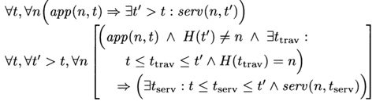

The above formulas belong to the realm of first-order logic, quite cumbersome. Temporal logic is a different formalism, better suited to our situation.

Temporal logic is a form of logic specifically tailored for statements and reasoning which involve the notion of order in time.

### The Language of Temporal Logic

The logic CTL* (Computation Tree Logic)

1. An execution is a sequence of states. Temporal logic uses *atomic propositions* to make statements about the states. These propositions are elementary statements which, in a given state, have a well-defined truth value. 
2. The classical boolean combinators are a necessary staple. These are the constants **true** and **false**, the negation **¬**, and the boolean connectives **∧** (conjunction, "and"), **∨** (disjunction, "or"), **⇒** (logical implication) and **⇔** (double implication, "if and only if").
3. The temporal combinators allow one to speak about the sequencing of the states along an execution, rather than about the mere states taken individually. 
  * The simplest combinators are **X ("next")**, **F ("future"/ will hold some day / at least once)** and **G (all the future / will always be)**.
  * **P states a property of the current state.**
  * XP states that the next state (X for "next") satisfies P. 
  * FP announces that a future state (F for "future") satisfies P without specifying which state.
  * GP that all the future states satisfy P.
  * G is the dual of F: `Gф ≡ ¬F¬ф`.
4. It is the ability to arbitrarily nest the various temporal combinators which gives temporal logic its power and its strength: the example G(alert ⇒ F halt) has an F in the scope of the G.
5. The **U ("until")** combinator (not to be confused with the set union symbol!) is richer and more complicated. ф1Uф2 states that ф1 is verified until ф2 is verified.
6. The logic introduced so far can only state properties of one execution. Special purpose quantifiers, **A ("all")** and **E ("exists")**, allow one to quantify over the set of executions. These are also called path quantifiers. The formula Aф states that all the executions out of the current state satisfy property ф, whereas Eф states that from the current state, there exists an execution satisfying ф.

>One must not confuse A and G: Aф states that all the executions currently possible satisfy ф, and Gф states that ф holds at every time step of the one execution being considered. More generally, **A and E quantify over paths, F and G quantify over positions along a given path.**

### The Formal Syntax of Temporal Logic

Formal grammar for `CTL*`:
```
ф,ψ ::= P1 | P2...                  (atomic proposition)
        | ¬ф | ф∧ψ | ф⇒ψ |...       (boolean combinators) 
        | Xф | Fф | Gф | фUψ |...   (temporal combinators)
        | Eф | Aф                   (path quantifiers)
```

### The Semantics of Temporal Logic

`A,σ,i |= ф`: "at time i of the execution σ, ф is true", where σ is an execution of A which we do not require to start at the initial state.

`σ,i |≠ ф` to state that ф is not satisfied at time i of σ.

`σ(i)` is the i-th state of σ and that `|σ|` is the length of σ.


We are ready to introduce a derived notion, "the automaton A satisfies ф", denoted `A |= ф`, and defined by:
```
A |= ф   iff σ,0 |= ф for every execution a of A.
```
But it is not elementary in that it treats as a group the correctness of all the executions (out of q0 ) of a model. Thus, A |≠ ф does not necessarily imply A |= ¬ф (whereas σ,i |≠ ф is equivalent to σ,i |= ¬ф).

### PLTL and CTL: Two Temporal Logics

**PLTL (Propositional Linear Temporal Logic)** and **CTL (Computation Tree Logic)** are the two most commonly used temporal logics in model checking tools, each may be viewed as a fragment of **CTL\***.

- PLTL is the fragment obtained from CTL* by withholding the A and E quantifiers. PLTL only deals with the set of executions and not with the way in which these are organized into a tree. We then speak of *path formulas* and sometimes use the somewhat barbaric terminology "linear time logic" for this kind of formalism.

- CTL is the fragment obtained from CTL* by requiring that each use of a temporal combinator (X, F, U, etc.) be under the immediate scope of a A or E quantifier. The combinators available to CTL can thus be taken to be EX, AX, E_U_, A_U_ and their derivatives: EF, etc.

### The Expressivity of CTL*

From a practical point of view, CTL* is almost always sufficient.


## Model Checking

### Model Checking CTL

The algorithm relies on the fact that CTL can only express state formulas (see section 2.4). Indeed, this characteristic of CTL allows us to reason in terms of which states satisfy which formulas, rather than considering the executions which are the true objects of our interest.

*Basic principle.*

The fundamental component of the model checking algorithm for CTL is a procedure **marking** which operates on an automaton A and which, starting from a CTL formula ф, will mark, for each state q of the automaton and for each sub-formula ψ of ф, whether ψ is satisfied in state q. In the end, for each state and each sub-formula, q.psi holds the value true if `q |= ψ`, false otherwise.

We use the term "marking" to mean that the value of q.psi is computed then memorized. Memorizing is important because the marking of q. phi uses the values of q'.psi for sub-formulas psi of phi and for states q' reachable from q. When the marking for phi is completed, it is easy to say whether `A |= ф` by looking up the value of qO.phi for the initial state q0 of A.

```
procedure marking(phi)
  case 1: phi = P
    for all q in Q, if P in l(q) then do q.phi := true, else do q.phi := false.
  case 2: phi = not psi
    do marking(psi);
    for all q in Q, do q.phi := not(q.psi).
  case 3: phi = psi! /\ psi2
    do marking(psi1); marking(psi2);
    for all q in Q, do q.phi := and(q.psi1, q.psi2).
  case 4: phi = EX psi
    do marking(psi);
    for all q in Q, do q.phi := false; /* initialisation */ 
    for all (q,q') in T, if q'.psi =true then do q.phi :=true.
  case 5: phi = E psi! U psi2
    do marking(psi1); marking(psi2); 
    for all q in Q,
      q.phi := false; q.seenbefore := false;/* initialisation */
    L := {};
    for all q in Q, if q.psi2 = true then do L := L + { q };
    while L nonempty {
      draw q from L; /* must mark q */ 
      L := L - { q };
      q.phi := true;
      for all (q',q) in T{ /* q' is a predecessor of q */
        if q' .seenbefore = false then do { 
          q'.seenbefore :=true;
          if q' .psi! = true then do L := L + { q' }; 
        }
      }
    }
  case 6: phi = A psi1 U psi2
    do marking(psi1); marking(psi2);
    L := {} /* L: states to be processed */
    for all q in Q,
      q.nb := degree(q); q.phi :=false; /* initialisation */ 
    for all q in Q, if q.psi2 = true then do L := L + { q };
    while L nonempty {
      draw q from L;  /* must mark q */
      L := L - { q };
      q.phi := true;
      for all (q',q) in T {  /* q' is a predecessor of q */
        q' .nb := q' .nb - 1;  /* decrement */
        if (q' .nb = 0) and (q' .psi1 =true) and (q'.phi =false)
          then do L := L + { q' };
      }
    }
```

We see how simple the marking is when ф is an atomic proposition (case 1), a negation (case 2) or a conjunction (case 3). In each of these three cases, the marking for ф only requires one pass over Q - in time `O(|Q|)` - plus the work required to mark the sub-formulas of ф.

When ф is of the form EXψ (case 4), the marking only requires a pass over T (the set of transitions of the automaton). Hence this step uses no more than time `O(|T|)`, added to the initialization and the marking time for ψ. The case AXψ was not treated: it is equivalent to ¬EX¬ψ.

When ф is of the form Eψ1Uψ2 (case 5), the marking of ф starting from the markings of ψ1 and ψ2 uses a standard algorithm for controlled reachability in a graph (with the proviso that the transitions are traversed backwards). We have chosen to describe such an algorithm in detail in order to stress how this step can be implemented without visiting each transition (q, q') ∈ T more than once, so as to perform the computation in time `O(|Q| + |T|)`.

The marking algorithm for ф of the form Aψ1Uψ2 (case 6) is a bit more complicated. It relies on the observation that a state q satisfies Aψ1Uψ2 if and only if either (a) q satisfies ψ2, or (b.1) q satisfies ψ1, (b.2) q has at least one successor state, and (b.3) all its successors satisfy Aψ1Uψ2. The marking algorithm will keep a counter nb associated with each state. Initially, q.nb is set to degree(q), that is the number of successors of q in the graph of the automaton. Then, each time a successor of q is marked as satisfying Aψ1Uψ2, the counter of q is decremented. When after decrementing q.nb reaches value 0, we know that all the successors of q satisfies ф.

*Correctness of the algorithm.*

*Complexity of the algorithm.*

The complexity analysis (including the termination proof) is simple: each step in the algorithm is associated either with the marking of a node q ∈ Q, or with the processing of a transition (q', q) of T. Hence, once the markings for ψ1 and ψ2 are complete, the time required to mark ф is in `O(|Q| + |T|)`, that is `O(|A|)`.

Finally, the marking for an arbitrary formula ф requires a marking for the sub-formulas of ф followed by a step specific to ф, which step requires time `O(|A|)`. The total time required for the complete marking is thus in `O(|A| × |ф|)`.


### Model Checking PLTL

In the case of PLTL we no longer deal with state formulas and it is no longer possible to rely on marking the automaton states. The formulas of PLTL are path formulas (see section 2.4) and a finite automaton will generally give rise to infinitely many different executions, themselves often infinite in length.

Consider for example the following formula ф: FP. 
An execution q0 , q1 , q2,... satisfying ф must contain infinitely many positions qn1,qn2,... at which P holds. 
Between each of these positions there can be an arbitrary (though finite) number of states satisfying -,F. We will say that the execution is of the form `((¬P)^*.P)^w`.
In the same spirit, an execution which does not satisfy ф must, from a certain position onwards, only contain states satisfying --,p_ Such an execution is said to be of the form `(P + ¬F)^*.(¬P)^w`.

### The State Explosion Problem


# Part II. Specifying with Temporal Logic

## Reachability Properties

**A reachability property states that some particular situation can be reached.**

### Reachability in Temporal Logic

Examples abound in practice: "we can obtain n < 0" (Rl), "we can enter a critical section" (R2).
Often the negation of a reachability property is the interesting property: "we cannot haven< 0" (R3), "we cannot reach the crash state" (R4).

When reachability properties are expressed in temporal logic, the EF combinator appears naturally, and reachability properties can be defined as those written EFØ, with Ø a propositional formula free of temporal combinators.

We note that the linear temporal logic PLTL is poorly suited for reachability properties.

### Model Checkers and Reachability

When a model checking tool is able to construct the reachability graph
of a system, it can in principle answer any reachability question by simply examining this graph, even if it does not include temporal logic.

### Computation of the Reachability Graph

The set of reachable states is in general not immediately apparent from a simple look at the system. Whenever several automata are synchronized (or when variables, clocks, counters, etc., are used) the effective construction of the set of reachable states becomes non-trivial.

Two algorithms deal with reachability problems: "forward chaining" and "backward chaining".


## Safety Properties

**A safety property expresses that, under certain conditions, an event never occurs.**

Examples most often without conditions: "both processes will never be in their critical section simultaneously" (S1), or "memory overflow will never occur" (S2), or "the situation ... is impossible" (S3). An example of safety with condition is "as long as the key is not in the ignition position, the car won't start" (S4).

### Safety Properties in Temporal Logic

Combinators AG in CTL, G in PLTL express safety properties in the most natural way.

In CTL, we can state (S1) and (S2) by 

e.g. AG¬(crit_sec1 ∧ crit_sec2 ) and AG-.overflow. 

The corresponding formulations in PLTL (that is, respectively, G¬(crit_sec1 ∧ crit_sec2) and G¬overflow) are equivalent.

### A Formal Definition

A "topological" notion of a safety property thus follows: it is any property P such that if a behavior C satisfies P then any reduced behavior C'⊆C a fortiori satisfies P .

### Safety Properties in Practice

In an ideal situation, a safety property is verified simply by submitting it to a model checker. In real life, hurdles spring up.

A simple case: non-reachability. In practice, a large number of safety properties are expressed as outright negated reachability properties: "the system cannot reach a state in which ... ".

Safety with explicit past. Recall that at present (to the best of our knowledge) no model checker is able to handle temporal formulas with past.

Eliminating the past. In principle, it is possible to translate any temporal logic formula combining past and future into an equivalent pure-future formula.


## Liveness Properties

A liveness property states that, under certain conditions, some event will ultimately occur.

Examples abound: "any request will ultimately be satisfied" (L1), or "by keeping on trying, one will eventually succeed" (L2), or "if we call on the elevator, it is bound to arrive eventually" (L3), or "the light will turn green" (L4), or finally "after the rain, the sunshine" (L5).

Note that mere reachability is not the issue.

There exist two broad families of liveness properties: simple liveness, which we may call progress, and repeated liveness, which is sometimes called fairness. This chapter is devoted to simple liveness.

### Simple Liveness in Temporal Logic

The *F* combinator is the one that expresses liveness in the most transparent way.

"any request will ultimately be satisfied" is expressed as `AG(req => AFsat)` in CTL and as `G(req => F sat)` in PLTL.

"The system can always return to its initial state" is expressed as AGEFinit in CTL.(In PLTL, no direct formulation of this notion exists.)

`PWQ` (where we do not require that a state satisfying Q exists) is a safety property and `PUQ`, which combines safety and liveness aspects, is classified, for lack of a better alternative, as a liveness property. The equivalence `PUQ ≡ FQ ∧ (PWQ)`.

### Liveness in the Model, Liveness in the Properties

We speak of an "abstract" liveness property. Now if we strengthen the property to a "bounded" liveness property (that is, to a property of the form "an event will occur within at most x time units"), then we obtain a safety property.

Liveness properties can play two rather different roles in the verification process. They can indeed either appear as liveness properties that we wish to verify, or as liveness hypotheses that we make on the system model.

Implicit hypotheses. When we use a mathematical model (for example automata) to represent a real system, the semantics of the model in fact define implicit safety and liveness hypotheses.

### Verification under Liveness Hypotheses

In the case where a mismatch exists between the real system behavior and the liveness hypotheses made by the model, verification by model checking remains possible if two conditions are met:
* the liveness hypotheses of the model must be less constraining than the de- sired liveness hypothesis: the behaviors of the model are more general than those of the real system.
* the temporal logic must be rich enough to express the liveness hypotheses that are not guaranteed by the model.

### Bounded Liveness

A bounded liveness property is a liveness property that comes with a maximal delay within which the "desired situation" must occur.

From a theoretical viewpoint, these properties are safety properties! Nonetheless, from a methodological viewpoint, bounded liveness properties are not as important as true safety properties.

Bounded liveness in timed systems. Bounded liveness properties are most often encountered in the specification of timed systems (see chapter 5). Indeed, in such situations it is possible to express and to verify explicit constraints on the delays.


## Deadlock-freeness

Deadlock-freeness is a special property, stating that the system can never be in a situation in which no progress is possible. It does fit the general pattern "some undesirable event will never occur" and one is tempted to declare it a safety property.

### Safety? Liveness?

In full generality, deadlock-freeness is written AGEXtrue in CTL, which reads as "whatever the state reached may be (AG), there will exist an immediate successor state (EX true)".

From a theoretical viewpoint, deadlock-freeness is not a safety property.

### Deadlock-freeness for a Given Automaton

We sometimes think of deadlock-freeness as a safety property because, for a given automaton, we can often describe the deadlocked states explicitly. It then suffices to verify that they cannot be reached.

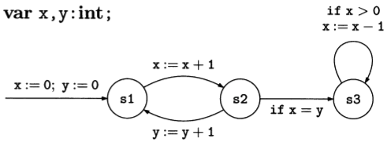

The automaton above is deadlock-free because the x and y values are always equal in state s1, and always different in state s2, so that state s3 can never be reached.
For that system, the deadlocked states are those in which the control state is s3 and in which x is less than or equal to zero. Thus, instead of using AG EX true, we can express the deadlock-freeness of this model by:

A |= AG¬(s3∧x≤0)

and the formula is indeed a safety property (it has the form AGф-).

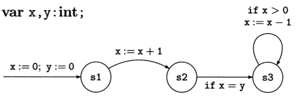

The behaviors of A' form a subset of the behaviors of A and, consequently, all the safety properties satisfied by A also hold for A'. However A' is not deadlock-free: once the state s2 is reached, the system is deadlocked, so that A no longer expresses deadlock-freeness.


## Fairness Properties

**A fairness property expresses that, under certain conditions, an event will occur (or will fail to occur) infinitely often.**

We also speak of *repeated liveness* (and sometimes of *repeated reachability*).

### Fairness in Temporal Logic

Temporal logic is one of the most appropriate formalisms to express fairness properties. The `F∞` combinator precisely corresponds to "an infinite number of times" , or "infinitely often". **An execution satisfies F∞P if it infinitely often encounters a state in which P holds.** Encountering a state satisfying P infinitely often is equivalent to finding states satisfying P arbitrarily far in the behavior: there is no last state in which P holds.

`G∞`, the dual of F∞, is also very useful. **An execution satisfies G∞P if P holds for all the states encountered,** except possibly for a finite number of them, or equivalently, if P is always true from a certain point.

CTL and fairness properties. Note that fairness properties cannot be expressed in pure CTL. As explained in chapter 2, CTL prohibits the nesting of G and F (to obtain F∞) unless a path quantifier, A or E, is inserted between the G and the F.
In the case of AF∞P, there is a way to respect the CTL syntax: AF∞P is equivalent to AG AFP. But there is no such solution for EF∞P, nor for richer statements such as E(F∞P1 ∧ F∞P2), etc.

This naturally leads to using **"CTL+fairness"**, a CTL extension in which
the F∞ and G∞ combinators are allowed.

From an algorithmic point of view, this extension is rather minor, but the computation times increase, `O(|A| x |ф|^2)` for CTL+fairness

> Difference Between Liveness and Fairness Properties
> Liveness Properties (Progress or simple liveness): Under certain conditions, some event will **ultimately** occur. "Any requst will ultimately be statisfied."
> Fairness properties (Repeat liveness): 
Under certain conditions, an event will occur (or will fail to occur) **infinitely often**.

### Fairness and Nondeterminism

When a nondeterministic choice occurs at some point, this choice is often assumed to be fair: it is not biased in such a way as to consistently omit one option.

The simplest case to imagine is that of a die with six faces, which is repeatedly thrown. Its behavior is fair if it fulfills the property:
```
A ('F∞1 ∧ F∞2 ∧ F∞3 ∧ F∞4 ∧ F∞5 ∧ F∞6) 
```

Note that this is a rather weak hypothesis which would be fulfilled by many biased dice.

A statement that the die fulfills some sort of equiprobability would be much more ambitious and would require much more complex stochastic propositions and models. **Fairness properties can be viewed as an abstraction of probabilistic properties.** This abstraction is very useful, and proves sufficient in many practical cases: the arguments presented in section 8.2 in favor of using liveness properties apply in particular to fairness properties.

### Fairness Properties and Fairness Hypotheses

Fairness properties are very often used as hypotheses.


### Strong Fairness and Weak Fairness

In the literature, we often find that a distinction is made between strong fairness and weak fairness. This terminology is rather classical. It applies to fairness properties of the form **"if P is continually requested, then P will be granted (infinitely often)"**. A property of this form can be formalized in several ways.

*Weak fairness.* The first option views "P is continuously requested" as applying to situations in which **P is requested without interruption**.
```
G ((G∞requests_P) => FP) ≡ G ((G∞requests_P) => F∞P)
```

*Strong fairness.* A different interpretation views "P is continuously requested" as meaning more generally that **P is requested in an infinitely repeated manner, possibly with interruptions.**
```
G ((F∞requests_P) => FP) ≡ G ((F∞requests_P) => F∞P)
```

*Strong/weak.* The "strong/weak" terminology is explained by the fact that a strong fairness property implies the corresponding weak fairness property, while the converse is generally false.

When using temporal logic for the model-checking of finite systems, there is no difference between strong and weak fairness. In this area, the strong/weak distinction is not relevant.

### Fairness in the Model or in the Property?

An important motivation for this work was the search for models of concurrency with a fair parallel operation on components.

Developing such mathematical models is very intricate. Moreover, once these choices are made, they are seldom satisfactory to whoever would like to verify properties with the help of a model checker.

In most cases, the best way is to consider the model as a pair *automaton + fairness hypotheses* in which the second parameter can change independently from the first.


## Abstraction Methods

By "abstraction methods" we mean a family of techniques which are used to simplify automata.

Tn this part of the book we only consider simplifications which aim at verifying a system (or verifying it faster) using a model checking approach. Thus we aim at reducing a complex problem "does `A |= ф`?" (Pbl) to a much simpler problem "does `A' |= ф'` ?" (Pb2).

### When Is Model Abstraction Required?

Two main types of situations lead to the need for a simplified model:
* Size of the automaton. The original model is too large to be verified by the tool at hand.
* Type of the automaton. The model checker at our disposal does not handle automata using a given construction.

### Abstraction by State Merging

Abstraction by state merging consists in viewing some states of an automaton as identical. We also speak of *folding*, or *quotient*.

We can visualize state merging in a very concrete way: the merged states are put together in a kind of super-state.

Not only has the number of states dropped, but more importantly, the number of transitions has been reduced as a result of merging.

### What Can Be Proved in the Abstract Automaton?

We can use state merging to verify safety properties. A' has more behaviors than A. Now the more behaviors an automaton has, the fewer safety properties it fulfills. Thus, if A' satisfies a safety property ф then a fortiori A satisfies ф. However, if A' does not satisfy ф, no conclusions can be drawn about A.

More behaviors. The automaton A' obtained by merging states shows more behaviors 1 than A does. On the one hand, all the executions of A remain present (perhaps in folded form) in A'. On the other hand, some new behaviors may be introduced by the merging operation.

Preserving safety properties. If A' satisfies a safety property ф, and if each execution of A is also an execution of A', then A also satisfies ф.

One-way preservation. A' can be used to verify a safety property, but not to invalidate it. Imagine that ф does not hold in A'. Then some behaviors of A' are unsafe. However, these behaviors may originate from the folding, and perhaps they don't occur in A. Thus we cannot conclude that A necessarily has unsafe behaviors.

Some necessary precautions. The informal description of the merging operation did not explain how the atomic propositions labelling the states were to be gathered on the super-states resulting from the merging. 
This problem has a theoretical answer. In principle, we must never merge states that are not labelled with the same properties.

Modularity. State merging is preserved by product. If A' is obtained from A by merging states, then the product automaton `A'||B` is also obtained from `A||B` by a merging operation. The modularity of merging makes it possible to reduce the components of a network of automata before computing their product automaton.

State merging in practice. State merging as described leads to the following question: how will we guess and then specify the sets of states to be merged when the automaton contains a large number of states? In practice, the user is the one who defines and applies his own abstrac- tions. Such work can be tedious and error-prone.

### Abstraction on the Variables

Abstraction on the variables is an abstraction technique which concerns the "data" part (as opposed to the "control" part) of automata with variables. An asset of variable abstraction is that it directly applies to the description of the automata with variables. Folding the automaton is therefore not necessary, which often proves crucial to the extent that abstraction aims at the verification of large systems.

Deleting variables. A remarkable consequence of such an operation is that the automaton A' obtained by removing all mentions of the variables from an automaton A inherits more behaviors than A. Thus all the safety properties satisfied by A' are a fortiori satisfied by A, or more precisely, by the automaton obtained from unfolding A. This situation is easy to see: with respect to the behavior of the skeleton, the effect of the variables is mostly to forbid the execution of some transitions in the configurations in which the guard is not fulfilled. Removing the guards yields more behaviors.

Practical aspects. If variables are removed because a tool cannot handle them, all of them will be removed. If the motivation is to avoid a combinatorial explosion problem in the unfolding, then we may choose to delete some variables and keep some others. In this case, modifying the guards may be difficult when deleted and remaining variables both appear: when in doubt, it is always possible to delete more guards.

Abstraction differs from deletion. When we wish to simplify the treatment of variables by an abstraction approach, we can appeal to less brutal techniques than outright deletion. These techniques pertain to abstract interpretation, the mathematical theory aiming at defining, analyzing, and justifying methods, based on abstraction, for the approximate computation of program properties.

Bounded variables. A strategy which is widely to simplify an automaton whose unfolding would result in state explosion is to narrow down the domain of the variables. The gain is obvious when going from an integer variable (in principle, infinitely many values) to a variable restricted to a finite integer interval, for instance all values from 0 to 10.

When bounded means limited. The simplification obtained by bounding the variables initially defined on a huge domain, for example all integers, is very often used in practice. Users generally don't see the simplification as an abstraction such as counting modulo k but rather as a behavior restriction induced by certain limits which cannot be exceeded.

### Abstraction by Restriction

Restriction is a particular form of simplification that operates by forbidding some behaviors of the system or by making some impossible. In practice, we can restrict an automaton by removing states, transitions, by strengthening the guards, etc.

What the restrictions preserve. If A' is obtained from A by restriction, then literally all the behaviors of A' are behaviors of A. Thus if A' does not satisfy a safety property, then a fortiori neither does A.

### Observer Automata

The method of observer automata aims at simplifying a system by restricting its legitimate behaviors to those accepted by an automaton outside the system, called observer automaton (or also testing automaton).

Compared to the restriction methods seen earlier, the observers method reduces the size of an automaton by restricting its behaviors rather than its structure (the states and the transitions).

Observer automata and temporal logic. In this section we have used observer automata to restrict the behavior of an automaton and, for the sake of sim- plicity, we have not mentioned their more advanced uses.

