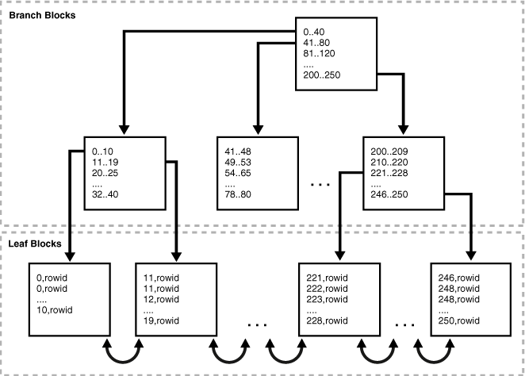
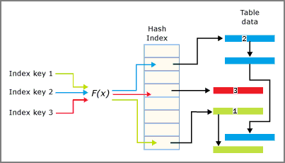
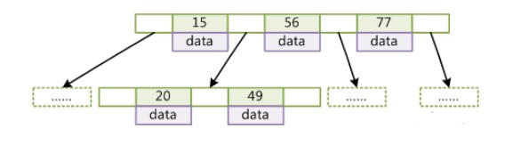
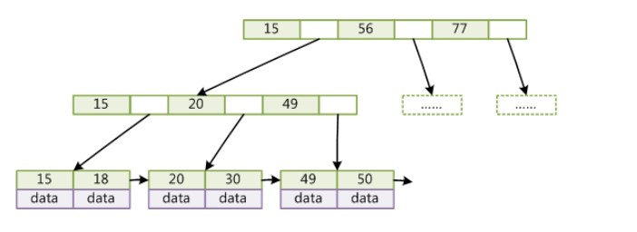

# 索引

索引是在存储引擎层实现的，而不是在服务器层实现的，所以不同存储引擎具有不同的索引类型和实现。

索引能够轻易将查询性能提升几个数量级。

对于非常小的表、大部分情况下简单的全表扫描比建立索引更高效。对于中到大型的表，索引就非常有效。但是对于特大型的表，建立和使用索引的代价将会随之增长。这种情况下，需要用到一种技术可以直接区分出需要查询的一组数据，而不是一条记录一条记录地匹配，例如可以使用分区技术。

## 1. 索引分类

### 1.1 B+ Tree 索引



B+ Tree 索引是大多数 MySQL 存储引擎的默认索引类型。

因为不再需要进行全表扫描，只需要对树进行搜索即可，因此查找速度快很多。

可以指定多个列作为索引列，多个索引列共同组成键。B+ Tree 索引适用于全键值、键值范围和键前缀查找，其中键前缀查找只适用于最左前缀查找。

除了用于查找，还可以用于排序和分组。

如果不是按照索引列的顺序进行查找，则无法使用索引。

### 1.2 哈希索引



基于哈希表实现，优点是查找非常快。

在 MySQL 中只有 Memory 引擎显式支持哈希索引。

InnoDB 引擎有一个特殊的功能叫“自适应哈希索引”，当某个索引值被使用的非常频繁时，会在 B-Tree 索引之上再创建一个哈希索引，这样就让 B-Tree 索引具有哈希索引的一些优点，比如快速的哈希查找。

限制：哈希索引只包含哈希值和行指针，而不存储字段值，所以不能使用索引中的值来避免读取行。不过，访问内存中的行的速度很快，所以大部分情况下这一点对性能影响并不明显；无法用于分组与排序；只支持精确查找，无法用于部分查找和范围查找；如果哈希冲突很多，查找速度会变得很慢。

### 1.3. 空间索引（R-Tree）

MyISAM 存储引擎支持空间索引，可以用于地理数据存储。

空间索引会从所有维度来索引数据，可以有效地使用任意维度来进行组合查询。

### 1.4 全文索引

MyISAM 存储引擎支持全文索引，用于查找文本中的关键词，而不是直接比较索引中的值。

使用 MATCH AGAINST，而不是普通的 WHERE。

## 2. 索引的优点

- 大大减少了服务器需要扫描的数据量；

- 帮助服务器避免进行排序和创建临时表；

- 将随机 I/O 变为顺序 I/O。

## 3. 索引优化

### 3.1 独立的列

在进行查询时，索引列不能是表达式的一部分，也不能是函数的参数，否则无法使用索引。

例如下面的查询不能使用 actor_id 列的索引：

```sql
SELECT actor_id FROM sakila.actor WHERE actor_id + 1 = 5;
```

### 3.2 前缀索引

对于 BLOB、TEXT 和 VARCHAR 类型的列，必须使用前缀索引，只索引开始的部分字符。

对于前缀长度的选取需要根据  **索引选择性**  来确定：不重复的索引值和记录总数的比值。选择性越高，查询效率也越高。最大值为 1 ，此时每个记录都有唯一的索引与其对应。

### 3.3 多列索引

在需要使用多个列作为条件进行查询时，使用多列索引比使用多个单列索引性能更好。例如下面的语句中，最好把 actor_id 和 film_id 设置为多列索引。

```sql
SELECT film_id, actor_ id FROM sakila.film_actor
WhERE actor_id = 1 AND film_id = 1;
```

### 3.4 索引列的顺序

让选择性最强的索引列放在前面，例如下面显示的结果中 customer_id 的选择性比 staff_id 更高，因此最好把 customer_id 列放在多列索引的前面。

```sql
SELECT COUNT(DISTINCT staff_id)/COUNT(*) AS staff_id_selectivity,
COUNT(DISTINCT customer_id)/COUNT(*) AS customer_id_selectivity,
COUNT(*)
FROM payment;
```

```html
   staff_id_selectivity: 0.0001
customer_id_selectivity: 0.0373
               COUNT(*): 16049
```

### 3.5 聚簇索引

聚簇索引并不是一种索引类型，而是一种数据存储方式。

术语“聚簇”表示数据行和相邻的键值紧密地存储在一起，InnoDB 的聚簇索引的数据行存放在 B-Tree 的叶子页中。

因为无法把数据行存放在两个不同的地方，所以一个表只能有一个聚簇索引。

**优点**

1. 可以把相关数据保存在一起，减少 I/O 操作；
2. 因为数据保存在 B-Tree 中，因此数据访问更快。

**缺点**

1. 聚簇索引最大限度提高了 I/O 密集型应用的性能，但是如果数据全部放在内存，就没必要用聚簇索引。
2. 插入速度严重依赖于插入顺序，按主键的顺序插入是最快的。
3. 更新操作代价很高，因为每个被更新的行都会移动到新的位置。
4. 当插入到某个已满的页中，存储引擎会将该页分裂成两个页面来容纳该行，页分裂会导致表占用更多的磁盘空间。
5. 如果行比较稀疏，或者由于页分裂导致数据存储不连续时，聚簇索引可能导致全表扫描速度变慢。

### 3.6 覆盖索引

索引包含所有需要查询的字段的值。

**优点**

1. 因为索引条目通常远小于数据行的大小，所以若只读取索引，能大大减少数据访问量。
2. 一些存储引擎（例如 MyISAM）在内存中只缓存索引，而数据依赖于操作系统来缓存。因此，只访问索引可以不使用系统调用（通常比较费时）。
3. 对于 InnoDB 引擎，若二级索引能够覆盖查询，则无需访问聚簇索引。

## 4. B-Tree 和 B+Tree 原理

### 4. 1 B-Tree



为了描述 B-Tree，首先定义一条数据记录为一个二元组 [key, data]，key 为记录的键，data 为数据记录除 key 外的数据。

B-Tree 是满足下列条件的数据结构：

- 所有叶节点具有相同的深度，也就是说 B-Tree 是平衡的；
- 一个节点中的 key 从左到右非递减排列；
- 如果某个指针的左右相邻 key 分别是 key<sub>i</sub> 和 key<sub>i+1</sub>，且不为 null，则该指针指向节点的所有 key 大于 key<sub>i</sub> 且小于 key<sub>i+1</sub>。

在 B-Tree 中按 key 检索数据的算法非常直观：首先从根节点进行二分查找，如果找到则返回对应节点的 data，否则对相应区间的指针指向的节点递归进行查找，直到找到节点或找到 null 指针，前者查找成功，后者查找失败。

由于插入删除新的数据记录会破坏 B-Tree 的性质，因此在插入删除时，需要对树进行一个分裂、合并、转移等操作以保持 B-Tree 性质。

### 4.2 B+Tree



与 B-Tree 相比，B+Tree 有以下不同点：

- 每个节点的指针上限为 2d 而不是 2d+1；
- 内节点不存储 data，只存储 key，叶子节点不存储指针。

带有顺序访问指针的 B+Tree

一般在数据库系统或文件系统中使用的 B+Tree 结构都在经典 B+Tree 基础上进行了优化，**在叶子节点增加了顺序访问指针，做这个优化的目的是为了提高区间访问的性能。**

### 4.4 为什么使用 B-Tree 和 B+Tree

红黑树等数据结构也可以用来实现索引，但是文件系统及数据库系统普遍采用 B-/+Tree 作为索引结构。

页是计算机管理存储器的逻辑块，硬件及操作系统往往将主存和磁盘存储区分割为连续的大小相等的块，每个存储块称为一页（在许多操作系统中，页得大小通常为 4k），主存和磁盘以页为单位交换数据。

**一般来说，索引本身也很大，不可能全部存储在内存中，因此索引往往以索引文件的形式存储的磁盘上。** 为了减少磁盘 I/O，磁盘往往不是严格按需读取，而是每次都会预读。这样做的理论依据是计算机科学中著名的局部性原理：当一个数据被用到时，其附近的数据也通常会马上被使用。**数据库系统的设计者巧妙利用了磁盘预读原理，将一个节点的大小设为等于一个页，这样每个节点只需要一次 I/O 就可以完全载入。** B-Tree 中一次检索最多需要 h-1 次 I/O（根节点常驻内存），渐进复杂度为 O(h)=O(logdN)。**一般实际应用中，出度 d 是非常大的数字，通常超过 100，因此 h 非常小（通常不超过 3）。而红黑树这种结构，h 明显要深的多。** 并且于逻辑上很近的节点（父子）物理上可能很远，无法利用局部性，效率明显比 B-Tree 差很多。

B+Tree 更适合外存索引，原因和内节点出度 d 有关。由于 B+Tree 内节点去掉了 data 域，因此可以拥有更大的出度，拥有更好的性能。
