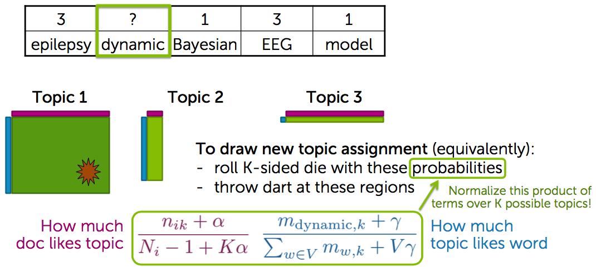

隐含狄利克雷分布，Latent Dirichlet Allocation，LDA

LDA是一种常见的主题模型算法。简单来说它是一个贝叶斯概率生成模型，用于对文档集进行降维或者潜在语义分析。

[TOC]

# LDA

文本包含一些主题，不同主题占据不同比重，而每个主题对应一种词频分布。现在的问题是，给定文本，如何从中反推出其中不同主题的比重，以及每个单词分属哪个主题？

LDA 是一种词袋模型，也就是说，它不考虑词语的先后关系和近邻关系，只考虑词语的频度。

详细的过程：

1. $α → θ_m → z_{m,n}$ 这个过程表示在生成第 $m$ 篇文档的时候，先从第一个坛子中抽了一个doc-topic 骰子 $θ_m$, 然后投掷这个骰子生成了文档中第 $n$ 个词的topic编号$z_{m,n}$；

2. $β → φ_k → w_{m,n|k=z_{m,n}}$, 这个过程表示用如下动作生成语料中第 $m$ 篇文档的第 $n$ 个词：在上帝手头的$K$个topic-word骰子 $φ_K$ 中，挑选编号为 $k=z_{m,n}$ 的那个骰子进行投掷，然后生成 word $w_{m,n}$；

简单来说，第一个过程是$p(z)$，第二个过程是$p(w|z)$。有$p(w,z) = p(w|z)p(z)$。

LDA的目标是找出每个词后潜在的主题，所以为此需要计算：

$$
p(z|w) = \frac{p(w,z)}{\sum_z p(w,z)}
$$

难点在于分母，简单分析一下分母的情况便可得出：公式难以直接计算。
文档中一个单词$w_i$的概率是

$$
p(w_i) = \sum_{k=1}^{K} p(w_i,z_i=k) = \sum_{k=1}^{K} p(w_i|z_i=k)p(z_i=k)
$$

所以

$$
p(w) = \sum_{z}^{K} p(w,z) = \prod_{i=1}^{N} \sum_{k=1}^{K} p(w_i|z_i=k)p(z_i=k)
$$

式中的$n$是语料中所有单词实例的总数，因为计算分母陷入了$K^n$ 项的难题。
这个离散状态空间（discrete state space）太大了以至于无法列举出来（enumerate）。
Thomas L.Griffiths等人从统计物理学的Potts Model获得灵感，开发出了LDA的蒙特卡洛马尔可夫（Monte Carlo Markov Chain）求解方法。

# 马尔科夫链 -> Metropolis-Hasting -> Gibbs Sampling

## 马尔科夫链

马尔可夫链条通俗说就是根据一个转移概率矩阵去转移的随机过程（ 马尔可
夫过程）

有这么一种情况，我的位置向量在若干次转移后会达到一个稳定状态，再转移
$π$向量也不变化了，这个状态称之为平稳分布状态$π$。

这个情况需要满足一个条件，这就是Detailed Balance，也就说一个封闭的环中，一个方向的概率连乘积=反过来方向的概率连乘积，假设我们的初始向量为$π=(1, 0, 0)$，现在用计算机软件计算矩阵乘法得到$π * P$ 1000次后的stationary distribution = (0.625, 0.3125, 0.0625)。注意这个平稳分布有且只有一个（是唯一的）。
所谓的detailed balance就是：
$$
π_i P_{ij} = π_j P_{ji}
$$
这里的π是平稳分布(stationary distribution)的那个$π$。

有了detailed balance，马尔可夫链就可以收敛了。我们可以根据detailed balance去sampling生成一些点，使这些点收敛到stationary distribution。因此这些点就是满足这个stationary distribution概率分布的点。收敛在这里称之为burning-in，在burning-in之前的若干迭代步骤生成的点被抛弃掉。

## Metropolis-Hasting

结合LDA算法，有了上述detail balance条件，受到这个平稳分布不再变化的启
发，我们的终极目标自然是：要使用一个 马尔可夫链条，sample 出一系列的状
态点，使其最终的平稳分布状态就是我们给定的那个联合概率分布（该联合概率就
是LDA里的文档集被生成(generate)的概率）。

MH算法的目的：是根据一个需求的(desired distribution)概率分布$P(x)$生成一系列样本状态点（因此，这个算法可以生成任意的概率分布）。为了达到这个目的，该算法使用马尔可夫过程去到达一个平稳分布$π(x)$(stationary distribution)，以使$π
(x)=P(x)$。

MH算法推导：为了达到这个平稳分布，有两个条件需要满足：
1. 满足detail balance：$π(x)P(x \to x') = π(x')P(x' \to x)$
2. 该平稳分布必须唯一

MH算法的方式是设计一个马尔可夫过程（通过构造转移概率）来满足上述两
个条件，用P(x)代替π(x)后，现在重点来分析detail balance：

$$
P(x)P(x \to x') = P(x')P(x' \to x)
$$
$$
\frac{P(x \to x')}{P(x' \to x)} = \frac{P(x')}{P(x)}
$$

MH算法是进一步将转移概率$P(x \to x')$，分解为两个子步骤：proposal distribu
tion(建议概率) $g(x \to x')$ 和acceptance distribution（接受概率） $A(x \to x')$。建议概率
是说我们给出状态x后转移到x’的条件概率，而接受概率是接受状态x’的条件概率。

所以转移概率 $P(x \to x') = g(x \to x')A(x \to x')$，代入公式detail balance
并整理可得：
$$
A(x->x')/A(x'->x) = P(x')g(x'->x)/P(x)g(x->x')
$$
也就是说这样我们得到了一个接受比率：“从状态x到x’的接受概率”与“x’到x的接受概率”的比率（接受率）。
Metropolis的选择是进一步将上述接受率改为如下形式（比率大于1就=1 上
限为1）：
$$
α = A(x \to x') = min\{1, \frac{P(x')g(x' \to x)}{P(x)g(x \to x')}\}
$$

## Gibbs Sampling

MH默认的流程是任意选择转移概率g(x)，然后利用接受率α来使得采样最终收敛于p(x)。但是如果我选择足够好的g(x)，使得每次发出的建议都是符合P(x)分布的建议，那么我就一直接受就行了(此时即接受率恒为1)。Gibbs Sampling采用的就是这种方式。

对于多维随机变量的概率分布p(x)而言，**选择完全条件概率(full conditionals)作为建议概率，此时可以证明的是接受率恒等于1**

full conditionals公式：

所以一旦在联合概率的full conditionals可用时，可以采用n维向量里轮流每一
个维度循环的方式来迭代达到平稳状态。

## Collapsed Gibbs sampling for LDA

> 采样的具体过程，参考 [A worked example for LDA](https://www.coursera.org/learn/ml-clustering-and-retrieval/lecture/qC5gv/what-is-collapsed-gibbs-sampling)

**1. 对于每个doc，给每个word随机赋值topic编号**

Doc1

Topic | 3 | 2 | 1 | 3 | 1
--- | --- | --- | --- | --- | ---
Word | epilepsy | dynamic | Bayesian | EEG | model

Doc2

Topic | 2 | 3 | 2 | 1 | 1
--- | --- | --- | --- | --- | ---
Word | cross | test | validate | likelihood | data

...

**2. 维护doc-topic和topic-word的计数统计**

- | Topic 1 | Topic 2 | Topic 3
--- | --- | --- | ---
Doc1 | 2 | 1 | 2
Doc2 | 2 | 2 | 1
... | | |

- | Topic 1 | Topic 2 | Topic 3
--- | --- | --- | ---
epilepsy | 1 | 0 | 35
Bayesian | 50 | 0 | 1
model | 42 | 1 | 0
EEG | 0 | 0 | 20
dynamic | 10 | 8 | 1
... | | |

**3. 对每个word重新赋值topic编号**

1. 去掉这个word原先的赋值，对维护的doc-topic和topic-word统计中相应的统计量，作-1操作
2. 计算下面俩值的乘积 (Probability of new assignment) :
    * How much doc “likes” each topic
    * How much each topic likes the word
3. 根据Probability of new assignment，重新对word的topic赋值
4. 更新维护的计数统计

Gibbs采样：
（1）随机给定每个单词的主题。
（2）根据转移概率依次产生每个单词的新的主题。
（3）收敛后，得到的采样极为所求的采样。

# 总结

我们可以清楚的看到，在整个LDA迭代过程中，只是不断地对每个单词的topic
编号重新指定，而 θ(doc->topic)和 φ(topic->word)两个概率向量是迭代训练完成后
通过期望公式计算出来的。

# Refs:

《LDA漫游指南》

《LDA数学八卦》

<https://www.coursera.org/learn/ml-clustering-and-retrieval/lecture/qC5gv/what-is-collapsed-gibbs-sampling>

<https://www.zybuluo.com/Dounm/note/435982>

<http://blog.csdn.net/mytestmy/article/details/39269105>
