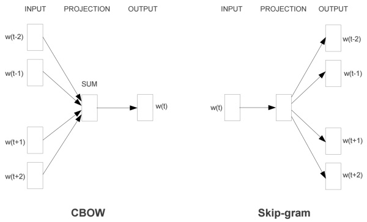
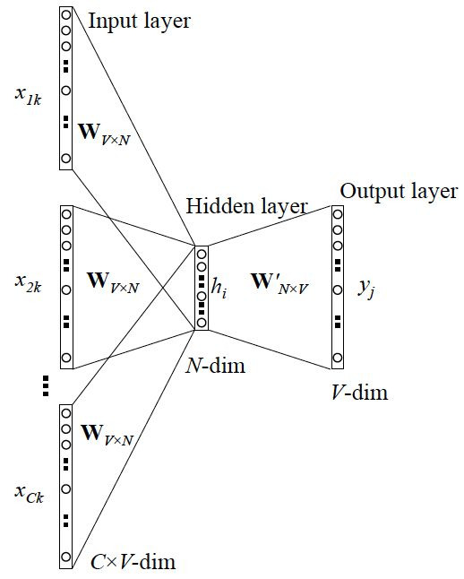
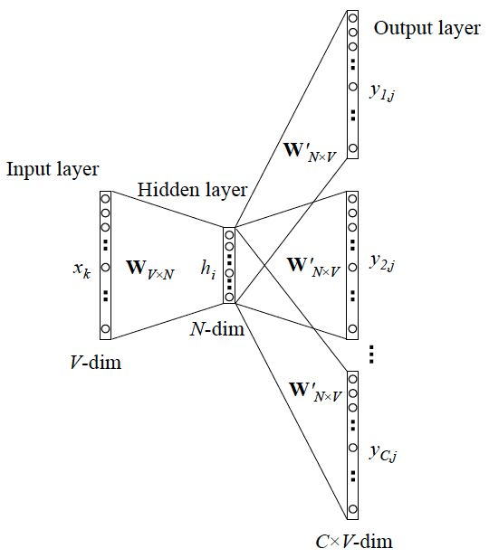

# Language Models

## Unigram (Bag-of-words)


In this model, the probability of each word only depends on that word's own probability in the document.


Conceptually, we can view bag-of-word model as a special case of the n-gram model, with n=1.


## N-gram


An n-gram is a contiguous sequence of n items from a given sequence of text or speech.

The words bigram and trigram language model denote n-gram model language models with n = 2 and n = 3, respectively.

An n-gram model is a type of probabilistic language model for predicting the next item in such a sequence in the form of a (n − 1)–order Markov model.

More concisely, an n-gram model predicts x_{i} based on x_{i-(n-1)},... ,x_{i-1}. In probability terms, this is `P(x_{i} | x_{i-(n-1)},... ,x_{i-1})}`.

Note that in a simple n-gram language model, the probability of a word, conditioned on some number of previous words (one word in a bigram model, two words in a trigram model, etc.) can be described as following a categorical distribution (often imprecisely called a "multinomial distribution").

In practice, the probability distributions are smoothed by assigning non-zero probabilities to unseen words or n-grams; see smoothing techniques.


## Neural language models

Neural language models (or Continuous space language models) use continuous representations or embeddings of words to make their predictions.

Continuous space embeddings help to alleviate the curse of dimensionality in language modeling.

Typically, neural net language models are constructed and trained as probabilistic classifiers that learn to predict a probability distribution


I.e., **the network is trained to predict a probability distribution over the vocabulary, given some linguistic context**. This is done using standard neural net training algorithms such as stochastic gradient descent with backpropagation. The context might be a fixed-size window of previous words, so that the network predicts


from a feature vector representing the previous k words. Another option is to use "future" words as well as "past" words as features, so that the estimated probability is


A third option, that allows faster training, **is to invert the previous problem and make a neural network learn the context, given a word**. One then maximizes the log-probability


This is called a **skip-gram** language model, and is the basis of the popular word2vec program.

## Skip-gram

skip-grams are a generalization of n-grams in which the components (typically words) **need not be consecutive** in the text under consideration, but ***may leave gaps that are skipped over***. They provide one way of overcoming the data sparsity problem found with conventional n-gram analysis.

Formally, an n-gram is a consecutive subsequence of length n of some sequence of tokens w1 … wn. **A k-skip-n-gram is a length-n subsequence where the components occur at distance at most k from each other.**

For example, in the input text:
```
the rain in Spain falls mainly on the plain
```
the set of 1-skip-2-grams includes all the bigrams (2-grams), and in addition the subsequences
```
the in, rain Spain, in falls, Spain mainly, falls on, mainly the, and on plain.
```


## Word2vec

Word2vec是一组用于生成文字嵌入的相关模型。 这些模型是浅层的双层神经网络，经过训练可重构语言的语境。 Word2vec将输入的大量文本作为输入，并生成一个向量空间，通常为几百个维度，每个唯一的单词在语料库中被分配一个相应的空间向量。 字向量位于向量空间中，使得共享语料库中公共上下文的单词在空间中彼此靠近。

词向量是神经网络语言模型的副产物

# CBOW & skip-grams



**continuous bag-of-words (CBOW)**: predicts the ***current word*** from a window of surrounding context words.

**skip-gram:** predict the surrounding window of ***context words***.

CBOW模型输入层输入的是上下文的onehot加和平均，输出层输出的是中心词的onehot。

skip-gram输入层输入的是中心词的onehot，输出层输出测试上下文onehot。

>According to Mikolov
>
>**Skip-gram**: works well with **small amount of the training data**, represents well even **rare words** or phrases.
>
>**CBOW**: several times **faster to train** than the skip-gram, slightly better accuracy for the **frequent words**
>
>In the "skip-gram" mode alternative to "CBOW", rather than averaging the context words, each is used as a pairwise training example. That is, in place of one CBOW example such as [predict 'ate' from average('The', 'cat', 'the', 'mouse')], the network is presented with four skip-gram examples [predict 'ate' from 'The'], [predict 'ate' from 'cat'], [predict 'ate' from 'the'], [predict 'ate' from 'mouse']. (The same random window-reduction occurs, so half the time that would just be two examples, of the nearest words.)

# Training algorithm

Word2vec 本质上是一个语言模型，它的输出节点数是 V 个，对应了 V 个词语，也是一个多分类问题，但实际当中，词语的个数非常非常多，直接softmax来计算会给计算造成很大困难，所以需要用技巧来加速训练。

# CBOW



**hierarchical softmax**

本质是把 N 分类问题变成 log(N)次二分类

对于原始的模型来说，由于使用的是softmax()函数，时间复杂度为 O(|V|)（|V|表示词典的总词数） ，因此计算代价很大，对大规模的训练语料来说，非常不现实。Huffman树是二叉树，在叶子节点及叶子节点的权给定的情况下，该树的带权路径长度最短。因此对于模型来说就是，词频越高的词，距离根节点就越近。

**negative sampling**

本质是预测总体类别的一个子集

第二种加速策略是Negative Sampling（简写NEG，负采样），这是Noise-Contrastive Estimation（简写NCE，噪声对比估计）的简化版本：把语料中的一个词串的中心词替换为别的词，构造语料 D 中不存在的词串作为负样本。然后极大化对数似然函数。

# skip-gram



<https://en.wikipedia.org/wiki/Language_model>

<https://en.wikipedia.org/wiki/N-gram>

<https://en.wikipedia.org/wiki/Bag-of-words_model>

<http://mccormickml.com/2016/04/19/word2vec-tutorial-the-skip-gram-model/>

<http://www.hankcs.com/nlp/word-vector-representations-word2vec.html>

<http://www.hankcs.com/nlp/word2vec.html>

[《word2vec中的数学原理详解》](http://blog.csdn.net/itplus/article/details/37969519)
