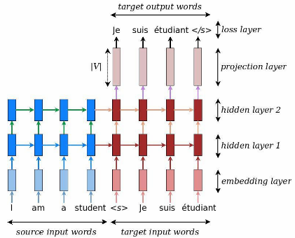
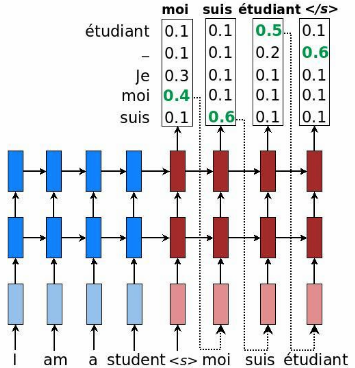

# Sequence-to-Sequence 模型

## 训练流程



```python

input_text = ['A', 'B', 'C']
output_text = ['D', 'E', 'F']
output_text_with_start = ['<SOS>'] + output_text
output_text_with_end = output_text + ['<EOS>']

encoder_state = encoder(input_text)
decoder_state = 0
output = []
for decoder_input, decoder_target in zip(output_text_with_start, output_text_with_end):
    # 根据decoder_input计算decode_output，更新decoder_state
    decoder_output, decoder_state = decoder(encoder_state, decoder_state, decoder_input)
    output.append(decoder_output)
    # 一般用交叉熵损失
    loss = loss_function(decoder_output, decoder_target)
```

## 预测流程



```python
input_text = ['床', '前', '明', '月', '光']

encoder_state = encoder(input_text)
decoder_state = 0
decoder_input = '<SOS>'
output = []
for _ in range(output_length_limit):
    # 根据decoder_input计算decode_output，更新decoder_state
    decoder_output, decoder_state = decoder(encoder_state, decoder_state, decoder_input)
    output.append(decoder_output)
    # 更新decoder_input为上一个时间步的decoder_output
    decoder_input = decoder_output
    # 如果察觉到句子结尾，则直接退出预测
    if decoder_output == '<EOS>':
        break
```
